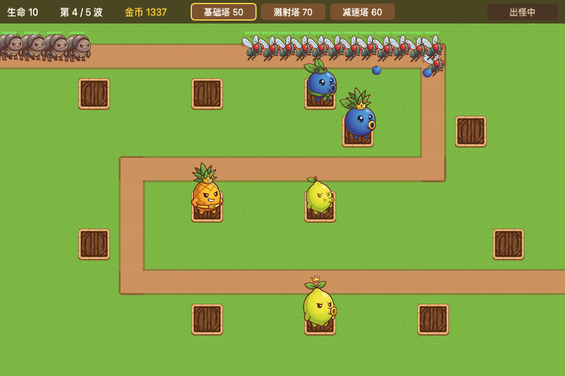
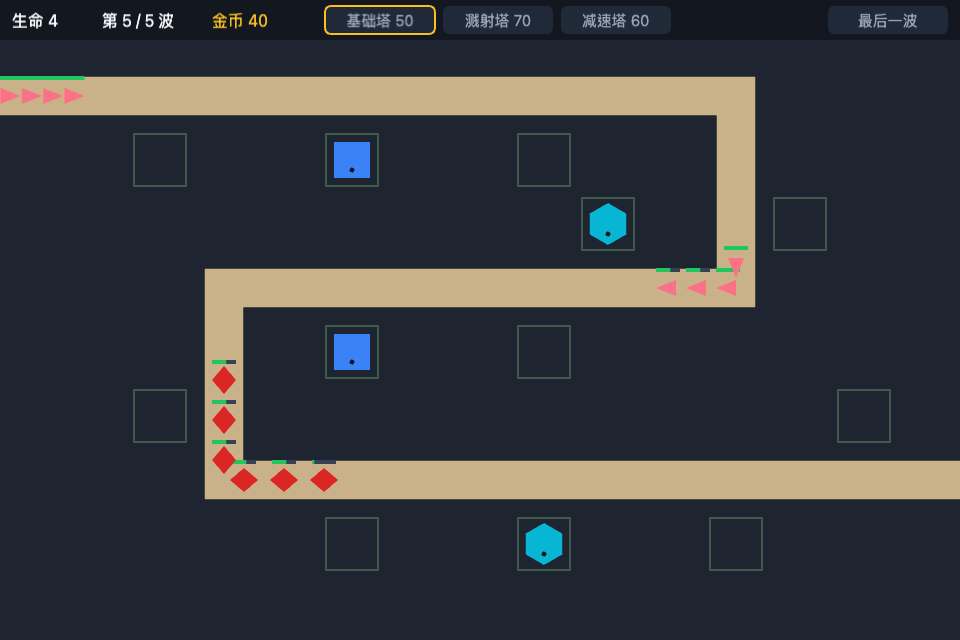

# Tower Defense

A small browser tower defense game built with **Phaser 4** and **TypeScript**. Defend an orchard
against waves of garden pests by building, upgrading and selling towers.

**▶ Play it: [tower-defense.kwoktung.workers.dev](https://tower-defense.kwoktung.workers.dev/)**
(fruit skin: [`?skin=fruit`](https://tower-defense.kwoktung.workers.dev/?skin=fruit))



The game is also a playground for a clean architecture. All rules live in a pure-TypeScript
**Simulation** that is unit-tested without a browser. Everything you see is drawn by a pluggable
**Skin**. Any moment of play can be built from data (a **Fixture**), shown in Storybook and
screenshotted, so that changes can be checked by eye as well as by tests.

## Gameplay

- **Towers**, each with 3 levels. Upgrade or sell them (for 70% back) from the panel that opens when you click a tower.

  | Tower  | Role                            |
  | ------ | ------------------------------- |
  | Basic  | Fast single-target shots        |
  | Splash | Damages every enemy in a radius |
  | Slow   | Slows the enemies it hits       |

- **Enemies**:

  | Enemy   | Trait                                                                                       |
  | ------- | ------------------------------------------------------------------------------------------- |
  | Normal  | —                                                                                           |
  | Fast    | Moves quickly                                                                               |
  | Armored | Armor takes a flat amount off every hit, so low-damage towers struggle and upgrades pay off |

- **Waves**: level 1 has 5 waves.
  - **Auto start**: once a wave is cleared, the next starts after 3 seconds.
  - **Early call**: you can call the next wave as soon as the current one has finished spawning, for 1 bonus gold per enemy still on the field.
- **Win** by clearing the last wave. **Lose** when your lives reach zero.

**Controls**

| Input                                                   | Action                                                |
| ------------------------------------------------------- | ----------------------------------------------------- |
| Choose a tower on the top bar, then click an empty plot | Build it                                              |
| Click a placed tower                                    | Open its panel (upgrade, or sell with a second click) |
| Click elsewhere or press `Esc`                          | Close the panel                                       |
| `D`                                                     | Toggle the Debug overlay                              |

## Skins

| Polygon (default)                             | Fruit                                     |
| --------------------------------------------- | ----------------------------------------- |
|  |  |

- **Polygon** is the default and the baseline for debugging and screenshots.
- **Fruit** is an original chibi orchard theme. Blueberry, pineapple and lemon towers face caterpillars, fruit flies and armored beetles. Open it with `?skin=fruit`.

## Getting started

Requirements:

- **Node.js 22.18 or newer**: the scripts are TypeScript run directly by Node.
- **pnpm**.

```sh
pnpm install
pnpm dev          # http://localhost:5173
```

Development-only URL parameters:

| Parameter     | Effect                           |
| ------------- | -------------------------------- |
| `?skin=<id>`  | Pick a skin (`polygon`, `fruit`) |
| `?debug`      | Start with the Debug overlay on  |
| `?level=<id>` | Load another bundled level       |

## Scripts

| Command                                      | What it does                                                                                                      |
| -------------------------------------------- | ----------------------------------------------------------------------------------------------------------------- |
| `pnpm dev`                                   | Run the game with hot reload                                                                                      |
| `pnpm test`                                  | Unit tests (Simulation, services) and story smoke tests (every story renders without `console.error`)             |
| `pnpm test:unit` / `pnpm test:stories`       | Just one of the two                                                                                               |
| `pnpm typecheck`, `pnpm lint`, `pnpm format` | TypeScript, ESLint (including the layering rules), Prettier                                                       |
| `pnpm storybook`                             | Storybook at http://localhost:6006                                                                                |
| `pnpm shots [filter] [--skin=<id>]`          | Build Storybook and screenshot every story (or the matching ones) into `.shots/`                                  |
| `pnpm balance`                               | Balance report: compares "more towers" against "upgrades" and plays level 1 with scripted strategies (about 20 s) |
| `pnpm art:fruit`                             | Rebuild the fruit skin's sprite atlas from the raw art                                                            |
| `pnpm build`                                 | Production build into `dist/`                                                                                     |
| `pnpm cf:preview` / `pnpm cf:deploy`         | Preview locally, or deploy `dist/` as a static site on Cloudflare Workers                                         |

## How it is built

```
scenes ──▶ render (Skins, HUD, Debug overlay) ──▶ sim (pure TypeScript)
   └─────▶ services (levels, progress) ──▶ content (JSON + zod schemas)
```

- **Simulation** (`src/sim`): a fixed 60 Hz tick.
  - It owns every rule: spawning, movement, targeting, damage, armor, slow, economy, waves and the outcome.
  - Player actions are method calls (`placeTower`, `upgradeTower`, `sellTower`, `startNextWave`, …) with matching read-only queries, so the UI never re-implements a rule.
  - It must not import Phaser, rendering or services; ESLint enforces this ([ADR-0001](docs/adr/0001-sim-render-separation.md)).
- **Skins** (`src/render/skins`): create the map and one view per entity, play one-off effects, and provide the HUD's colour tokens. A skin decides how each tower level looks, and the content data holds no art ([ADR-0002](docs/adr/0002-skins-own-tower-level-appearance.md)).
- **Content** (`content/`): the unit catalog (per-level tower stats, enemy stats) and level definitions (grid, path, slots, waves), all as JSON validated with zod. Balance is tuned here.
- **Fixtures and stories** (`src/fixtures`, `src/stories`): named, builder-made game states shared by tests and Storybook. Scenario stories can run, fast-forward, and produce screenshot timelines.

### Fruit art pipeline

1. The fruit art was generated with Gemini on a flat magenta background. The prompts are logged in [`art/fruit/prompts.md`](art/fruit/prompts.md).
2. `pnpm art:fruit` (ImageMagick 7) removes the background, splits each sheet into frames and packs them into the atlas in `src/render/skins/fruit/assets/`. Running it twice gives byte-identical output.
3. Raw images live in `art/fruit/raw/`, which is not committed.

## Project docs

- [`CONTEXT.md`](CONTEXT.md): the domain glossary (Tower level, Armor, Slow, Auto start, Early call, …). Code, tests and tickets use these terms.
- [`docs/adr/`](docs/adr): architecture decisions.
- [`AGENTS.md`](AGENTS.md): working conventions for contributors and coding agents.
- `.scratch/`: specs and tickets for each feature, plus the [playability roadmap](.scratch/playability-roadmap/roadmap.md).
